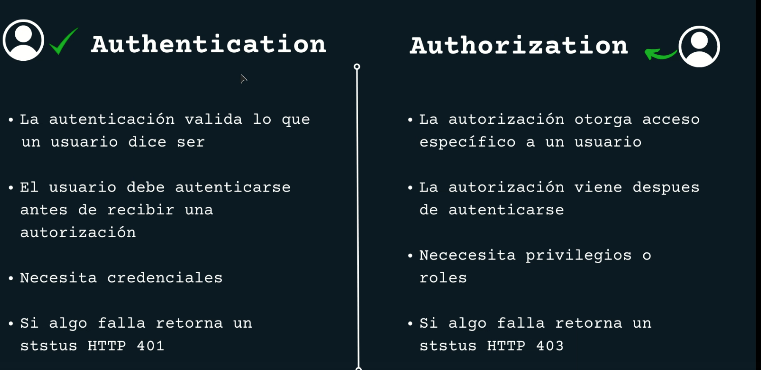
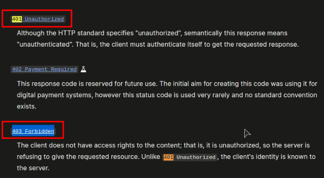
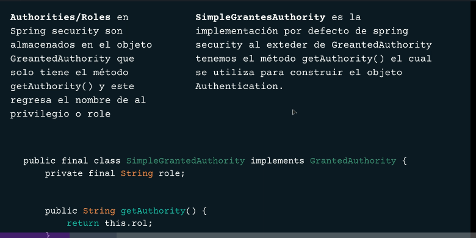
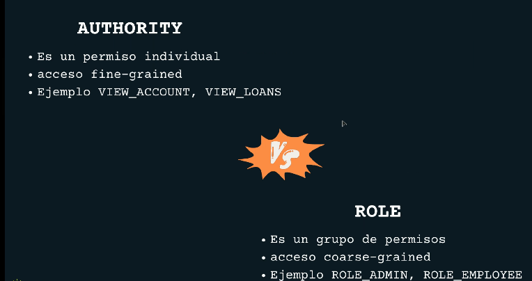
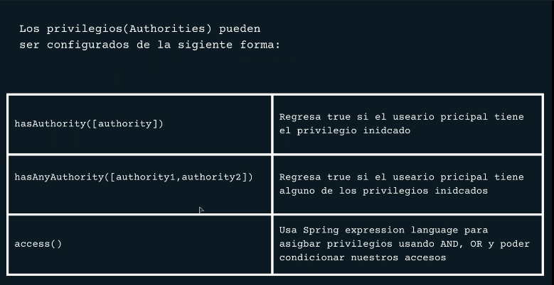
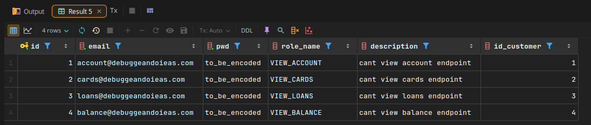
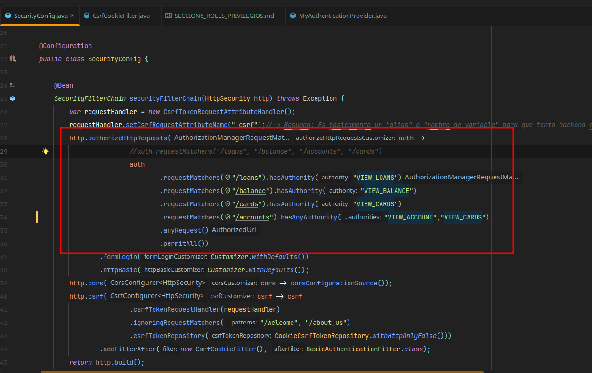
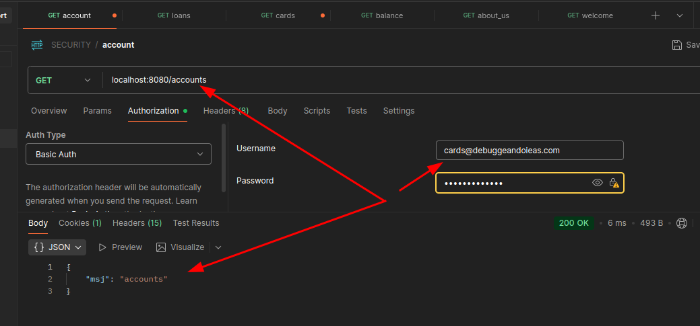
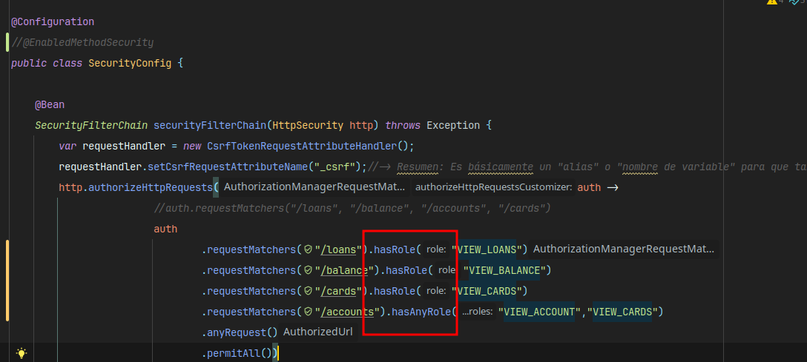
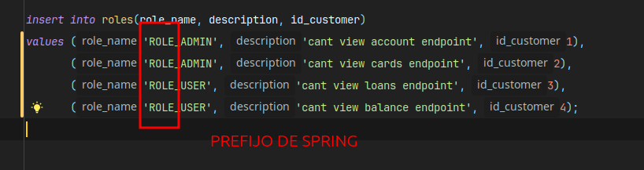

# 🛡️ 🌐🔒 Spring Security — ROLES Y PRIVILEGIOS️

## 📝 Clase 41 - INTRODUCCION ROLES , PRIVILEGIOS Y AUTENTICACION 🔒 🔒 🔑🔑





---





---




    
---
## 📝 Clase 42 - Agregando authorities a la base de datos  🔒 🔑🔑

- Se crean dos tablas customers - roles
- aplicamos JOIN



## 📝 Clase 43 - Modificando entidades y autenticando provider 🔒 🔑🔑

- En CustomerEntity se agrega 
```java

@OneToMany(fetch = FetchType.EAGER)
@JoinColumn(name = "id_customer")
private List<RoleEntity> roles;
```

- Se crea clase RoleEntity -> esta es la hija de CustomerEntity

```java
@Entity
@Table(name = "roles")
@Data
public class RoleEntity {

    @Id
    @GeneratedValue(strategy = GenerationType.IDENTITY)
    private BigInteger id;
    @Column(name = "role_name")
    private String name;
    private String description;
}

```

- En MyAuthenticationProvider se agrega:


---
# EXTRA -> ENTENDER EL FLUJO 

# Flujo de Spring Security - Explicación

## Diagrama de Flujo General

```
┌─────────────────────────────────────────────────────────────────────┐
│                        PETICIÓN HTTP                                │
└─────────────────────────────────────────────────────────────────────┘
                                │
                                ▼
┌─────────────────────────────────────────────────────────────────────┐
│                    SecurityFilterChain                              │
│  ┌─────────────────────────────────────────────────────────────┐   │
│  │ 1. CORS Filter (corsConfigurationSource)                    │   │
│  └─────────────────────────────────────────────────────────────┘   │
│                                │                                    │
│                                ▼                                    │
│  ┌─────────────────────────────────────────────────────────────┐   │
│  │ 2. CSRF Filter + CookieCsrfTokenRepository                  │   │
│  └─────────────────────────────────────────────────────────────┘   │
│                                │                                    │
│                                ▼                                    │
│  ┌─────────────────────────────────────────────────────────────┐   │
│  │ 3. BasicAuthenticationFilter                                │   │
│  └─────────────────────────────────────────────────────────────┘   │
│                                │                                    │
│                                ▼                                    │
│  ┌─────────────────────────────────────────────────────────────┐   │
│  │ 4. CsrfCookieFilter (DESPUÉS de BasicAuth)                  │   │
│  └─────────────────────────────────────────────────────────────┘   │
└─────────────────────────────────────────────────────────────────────┘
                                │
                                ▼
┌─────────────────────────────────────────────────────────────────────┐
│                 MyAuthenticationProvider                            │
│         (Valida credenciales contra la BD)                          │
└─────────────────────────────────────────────────────────────────────┘
                                │
                                ▼
┌─────────────────────────────────────────────────────────────────────┐
│                        CONTROLADOR                                  │
└─────────────────────────────────────────────────────────────────────┘
```

---

## 1. SecurityConfig - Configuración Principal

### `securityFilterChain()`

| Configuración | Descripción |
|---------------|-------------|
| `authorizeHttpRequests` | `/loans`, `/balance`, `/accounts`, `/cards` requieren autenticación. El resto es público |
| `formLogin` | Habilita login por formulario |
| `httpBasic` | Habilita autenticación básica (usuario:contraseña en header) |
| `cors` | Permite peticiones cross-origin |
| `csrf` | Configura protección CSRF con cookies |

### Configuración CSRF

```java
csrf -> csrf
    .csrfTokenRequestHandler(requestHandler)     // Maneja el token con nombre "_csrf"
    .ignoringRequestMatchers("/welcome", "/about_us")  // Excluye estas rutas
    .csrfTokenRepository(CookieCsrfTokenRepository.withHttpOnlyFalse())  // Token en cookie accesible por JS
```

---

## 2. MyAuthenticationProvider - Autenticación Personalizada

```
┌──────────────┐     ┌─────────────────────────┐     ┌────────────────┐
│   Usuario    │────▶│ MyAuthenticationProvider│────▶│ CustomerRepo   │
│ (email/pwd)  │     │                         │     │    (BD)        │
└──────────────┘     └─────────────────────────┘     └────────────────┘
                                │
                                ▼
                     ┌─────────────────────────┐
                     │ ¿Contraseña coincide?   │
                     └─────────────────────────┘
                          │           │
                         Sí          No
                          ▼           ▼
              ┌───────────────┐  ┌──────────────────┐
              │ Retorna Token │  │ BadCredentials   │
              │ con roles     │  │ Exception        │
              └───────────────┘  └──────────────────┘
```

---

## 3. CsrfCookieFilter - Exposición del Token CSRF

Este filtro se ejecuta **después** de `BasicAuthenticationFilter`:

```java
.addFilterAfter(new CsrfCookieFilter(), BasicAuthenticationFilter.class)
```

**Propósito**: Exponer el token CSRF en el header de respuesta para que el frontend pueda usarlo.

```
Petición entrante
       │
       ▼
┌─────────────────────────────────────┐
│ Obtener CsrfToken del request       │
│ request.getAttribute(CsrfToken...)  │
└─────────────────────────────────────┘
       │
       ▼
┌─────────────────────────────────────┐
│ ¿Token no es null?                  │
│         │                           │
│        Sí ──▶ Agregar header:       │
│              X-CSRF-TOKEN: <token>  │
└─────────────────────────────────────┘
       │
       ▼
┌─────────────────────────────────────┐
│ filterChain.doFilter() - continuar  │
└─────────────────────────────────────┘
```

---

## Resumen del Flujo Completo

1. **Petición llega** → CORS valida origen permitido
2. **CSRF verifica** → Token válido (excepto `/welcome`, `/about_us`)
3. **Autenticación** → `MyAuthenticationProvider` valida contra BD
4. **CsrfCookieFilter** → Agrega token CSRF al header de respuesta
5. **Autorización** → Verifica si el endpoint requiere autenticación
6. **Controlador** → Procesa la petición

---
### DETALLE :
## ¿Por qué usar `.map()` aquí?

El `map()` es necesario porque tienes **dos tipos incompatibles**:

```
Tu entidad:     Role         →  tiene: id, name, description, etc.
Spring necesita: GrantedAuthority  →  solo necesita: String (nombre del rol)
```

### Razón técnica

```java
// Tu clase Role (entidad JPA)
public class Role {
    private Long id;
    private String name;  // ← Spring solo necesita esto
    private String description;
}

// SimpleGrantedAuthority (de Spring)
public class SimpleGrantedAuthority implements GrantedAuthority {
    private String role;  // ← Solo guarda el nombre
}
```

### El map() hace esta conversión:

| Antes del map | Después del map |
|---------------|-----------------|
| `Role{id=1, name="ROLE_ADMIN"}` | `SimpleGrantedAuthority("ROLE_ADMIN")` |
| `Role{id=2, name="ROLE_USER"}` | `SimpleGrantedAuthority("ROLE_USER")` |

### Sin el map:

```java
// ❌ Error de compilación - tipos incompatibles
List<Role> roles = customer.getRoles();
new UsernamePasswordAuthenticationToken(username, pwd, roles);
//                                                      ↑
// Espera: Collection<? extends GrantedAuthority>
// Recibe: List<Role>
```

### Con el map:

```java
// ✅ Correcto - tipos compatibles
List<SimpleGrantedAuthority> authorities = roles.stream()
    .map(role -> new SimpleGrantedAuthority(role.getName()))
    .collect(Collectors.toList());
new UsernamePasswordAuthenticationToken(username, pwd, authorities);
```

**Resumen**: `map()` transforma cada elemento de un tipo a otro. Aquí convierte `Role` → `SimpleGrantedAuthority` extrayendo solo el nombre del rol.

---

### PARA QUE SIRVE SIMPLEGRANTEDAUTHORITY

## `SimpleGrantedAuthority` - Propósito

Es una **implementación simple** de la interfaz `GrantedAuthority` de Spring Security.

### ¿Para qué sirve?

| Propósito | Descripción |
|-----------|-------------|
| **Representar permisos/roles** | Almacena un `String` que representa un rol o autoridad |
| **Control de acceso** | Spring Security lo usa para verificar si un usuario puede acceder a un recurso |

### Estructura interna

```java
public class SimpleGrantedAuthority implements GrantedAuthority {
    private final String role;  // Solo guarda un String
    
    public String getAuthority() {
        return this.role;
    }
}
```

### Ejemplos de uso

```java
// Roles
new SimpleGrantedAuthority("ROLE_ADMIN")
new SimpleGrantedAuthority("ROLE_USER")

// Permisos específicos
new SimpleGrantedAuthority("READ_PRIVILEGE")
new SimpleGrantedAuthority("WRITE_PRIVILEGE")
```

### ¿Dónde lo usa Spring Security?

```java
// En anotaciones
@PreAuthorize("hasRole('ADMIN')")
@PreAuthorize("hasAuthority('READ_PRIVILEGE')")

// En configuración
.requestMatchers("/admin/**").hasRole("ADMIN")
.requestMatchers("/api/**").hasAuthority("API_ACCESS")
```

### Resumen

`SimpleGrantedAuthority` es un **contenedor de String** que Spring Security entiende para determinar **qué puede hacer un usuario** en la aplicación. Es la forma estándar de representar roles y permisos en Spring Security.

---
# ESTO ES UN RESUMEN MAS DE UN FLUJO SOBRE TODO EL PROCESO DE AUTENTICACION Y AUTORIZACION EN SPRING SECURITY
## Resumen del Flujo de Seguridad - Carpeta `security/`

### ✅ Tu explicación es **correcta**. Aquí un resumen estructurado:

---

### 1. `SecurityConfig.java` - Configuración Principal

| Componente | Función |
|------------|---------|
| **Endpoints protegidos** | `/loans`, `/balance`, `/accounts`, `/cards` requieren autenticación |
| **Endpoints públicos** | Todo lo demás (incluyendo `/welcome`, `/about_us`) |
| **CORS** | Permite cualquier origen, método y header |
| **CSRF** | Token guardado en cookie, accesible desde frontend con `_csrf` |

---

### 2. `CsrfCookieFilter.java` - Filtro CSRF

```
Request → Obtiene token CSRF → Lo setea en header de response → Continúa cadena
```

- Se ejecuta **después** de `BasicAuthenticationFilter`
- Expone el token CSRF al frontend via headers

---

### 3. `MyAuthenticationProvider.java` - Autenticación Personalizada

```
┌─────────────────────────────────────────────────────────────┐
│  1. Recibe credenciales (email + password)                  │
│                         ↓                                   │
│  2. Busca cliente en BD por email                           │
│     → Si no existe: BadCredentialsException                 │
│                         ↓                                   │
│  3. Compara password con passwordEncoder.matches()          │
│     → Si no coincide: BadCredentialsException               │
│                         ↓                                   │
│  4. Obtiene roles del cliente                               │
│                         ↓                                   │
│  5. Convierte roles → List<SimpleGrantedAuthority>          │
│     (rol BD → SimpleGrantedAuthority para Spring Security)  │
│                         ↓                                   │
│  6. Retorna UsernamePasswordAuthenticationToken             │
│     (username, password, authorities)                       │
└─────────────────────────────────────────────────────────────┘
```

---

### 📝 Corrección menor

Tu explicación dice *"se guarda en customer"* - más preciso sería: **se obtiene el objeto customer desde la BD** (no se guarda, se recupera).

---

### Flujo Completo

```
Frontend → SecurityFilterChain → CORS → CSRF Filter → AuthenticationProvider → Acceso/Rechazo
```

---

## 📝 Clase 44 - CONFIGURANDO PRIVILEGIOS 🔒 🔒 🔑🔑

- se agrega hasAuthority en SecurityConfig 




### Explicacion adicional :

## Diferencia entre `authorizeHttpRequests` y `MyAuthenticationProvider`

Son **dos cosas completamente diferentes** que trabajan juntas:

| Componente | Función | Pregunta que responde |
|------------|---------|----------------------|
| `authorizeHttpRequests` | **Autorización** | ¿Este usuario PUEDE acceder a este recurso? |
| `MyAuthenticationProvider` | **Autenticación** | ¿Este usuario ES QUIEN DICE SER? |

## Flujo completo

```
Usuario envía email + password
              ↓
    ┌─────────────────────────────────┐
    │   MyAuthenticationProvider      │  ← AUTENTICACIÓN
    │   - Busca usuario en BD         │
    │   - Valida contraseña           │
    │   - Carga roles/permisos        │
    └─────────────────────────────────┘
              ↓Usuario autenticado ✓
              ↓
    Usuario intenta acceder a /loans
              ↓
    ┌─────────────────────────────────┐
    │   authorizeHttpRequests         │  ← AUTORIZACIÓN
    │   - ¿Tiene VIEW_LOANS?          │
    │   - SÍ → Acceso permitido       │
    │   - NO → Error 403 Forbidden    │
    └─────────────────────────────────┘
```

## ¿Quién llama a `MyAuthenticationProvider`?

Spring Security lo detecta automáticamente porque:

1. Tiene `@Component` → Spring lo registra como bean
2. Implementa `AuthenticationProvider` → Spring Security lo usa

```
formLogin() o httpBasic()
        ↓
AuthenticationManager (interno de Spring)
        ↓
Busca todos los AuthenticationProvider disponibles
        ↓
Llama a MyAuthenticationProvider.authenticate()
```

## ¿Es necesario `MyAuthenticationProvider`?

**SÍ, es necesario** porque:

- Sin él, Spring no sabe **cómo** verificar las credenciales contra tu base de datos
- `authorizeHttpRequests` solo verifica permisos **después** de que el usuario ya está autenticado

## Resumen

```
MyAuthenticationProvider  →  "¿Eres tú?" (verifica email/password)
authorizeHttpRequests     →  "¿Puedes hacer esto?" (verifica permisos)
```

**Ambos son necesarios**. Uno no reemplaza al otro.

---
## `CsrfCookieFilter` - Dónde entra en el flujo

Este filtro se ejecuta **después de la autenticación pero antes de la autorización**.

### Posición en el flujo

```
Usuario envía credenciales
              ↓
    ┌─────────────────────────────────┐
    │   1. CORS Filter                │
    └─────────────────────────────────┘
              ↓
    ┌─────────────────────────────────┐
    │   2. CSRF Filter (validación)   │
    └─────────────────────────────────┘
              ↓
    ┌─────────────────────────────────┐
    │   3. BasicAuthenticationFilter  │  ← Autenticación HTTP Basic
    │      (llama a MyAuthProvider)   │
    └─────────────────────────────────┘
              ↓
    ┌─────────────────────────────────┐
    │   4. CsrfCookieFilter ⭐         │  ← TU FILTRO AQUÍ
    │   (expone token en response)    │
    └─────────────────────────────────┘
              ↓
    ┌─────────────────────────────────┐
    │   5. authorizeHttpRequests      │  ← Autorización
    └─────────────────────────────────┘
              ↓
          Controlador
```

### ¿Por qué se ubica ahí?

En tu `SecurityConfig`:

```java
.addFilterAfter(new CsrfCookieFilter(), BasicAuthenticationFilter.class)
```

Esto significa: **ejecutar `CsrfCookieFilter` inmediatamente después de `BasicAuthenticationFilter`**.

### ¿Qué hace exactamente?

| Paso | Acción |
|------|--------|
| 1 | Obtiene el token CSRF del request |
| 2 | Lo agrega al **header de la respuesta** |
| 3 | El frontend puede leerlo para futuras peticiones |

### Flujo visual del token CSRF

```
┌──────────────────────────────────────────────────────────┐
│  Request llega con cookie XSRF-TOKEN                     │
│                      ↓                                   │
│  Spring extrae token → request.getAttribute()            │
│                      ↓                                   │
│  CsrfCookieFilter lo copia al HEADER de respuesta        │
│  response.setHeader("X-CSRF-TOKEN", token)               │
│                      ↓                                   │
│  Frontend lee el header y lo usa en próximas peticiones  │
└──────────────────────────────────────────────────────────┘
```

### Resumen del orden completo

| Orden | Componente | Propósito |
|-------|------------|-----------|
| 1º | CORS | ¿Origen permitido? |
| 2º | CSRF | ¿Token CSRF válido? |
| 3º | BasicAuthFilter + **MyAuthenticationProvider** | ¿Credenciales correctas? (Autenticación) |
| 4º | **CsrfCookieFilter** | Exponer token CSRF en response |
| 5º | authorizeHttpRequests | ¿Tiene permisos? (Autorización) |
| 6º | Controlador | Procesar petición |

**Tu filtro actúa como un "puente" que facilita al frontend obtener el token CSRF para usarlo en peticiones POST/PUT/DELETE.**



---

## 📝 Clase 45 - AGREGANDO ROLES A LA BASE DE DATOS 👤👤 🔑🔑

- Se agregan roles a la base de datos cambiamos en requestMatchers



- Tambien en la base de datos hacemos un cambio



- SPRINGBOOT TIENE UN PREFIJO LLAMADO ROLE_ PARA LOS ROLES